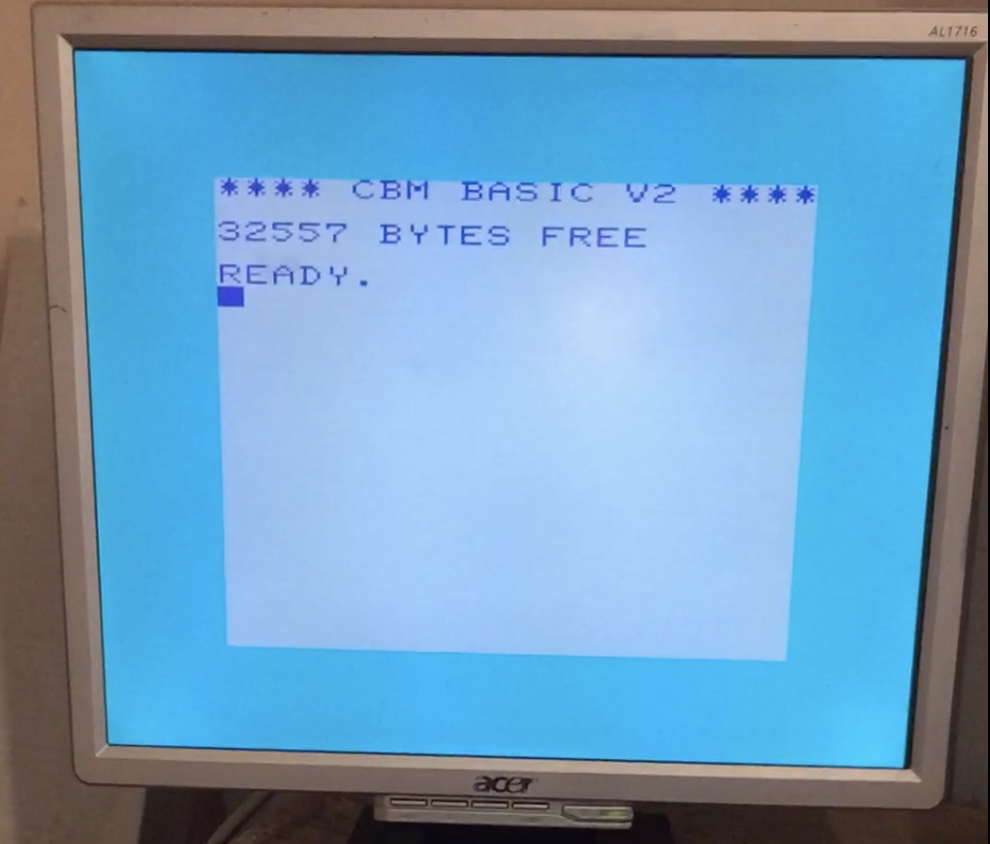

# PICOVIC

This is a Commodore Vic-20 emulator for the [Raspberry Pi Pico](https://www.raspberrypi.org/products/raspberry-pi-pico/)

Most of the 6502 emulation code is from [fake6502](http://rubbermallet.org/fake6502.c).

A PS/2 keyboard can be plugged in to the pico according to [the schematic](hardware/picovic.pdf) and is used as an input device.

VGA output is based on the scanvideo code from [pico-extra](https://github.com/raspberrypi/pico-extras/tree/master/src/common/pico_scanvideo)

The emulation is extremely basic and for example the VIAs are only emulated so that the cursor works in BASIC. The VIC chip only has the most simple functionality, in the interest of speed and laziness. However since for the time being the emulated speed is higher than the original VIC-20, more functionality will be added in the future.

[Running BASIC video](basic.mp4)